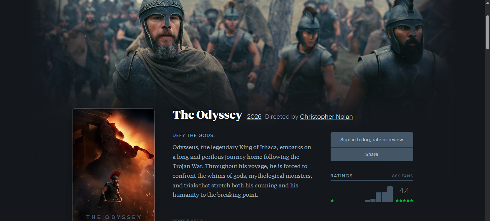
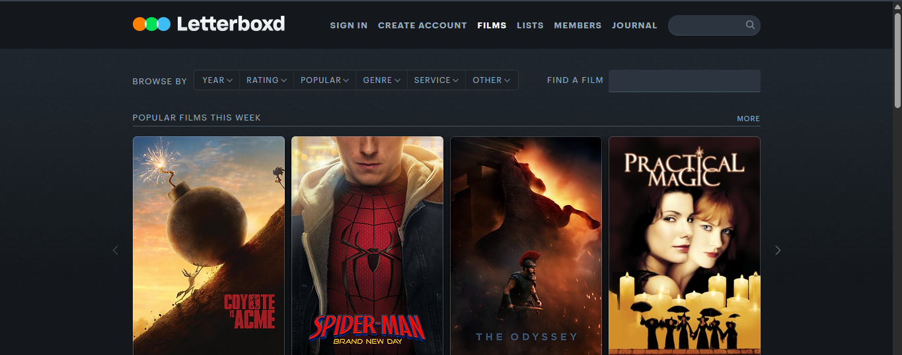
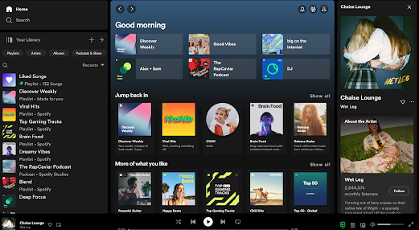
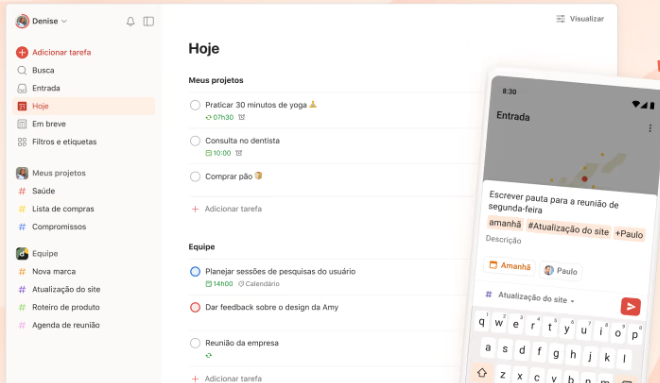

# References — LetterTime

## 1. Objetivo

As referências abaixo orientam as decisões de experiência e interface do LetterTime. O Letterboxd é a referência principal — é o produto que mais inspirou o projeto, então usamos duas telas dele, cada uma mostrando um padrão diferente que reaproveitamos. As outras duas vêm de fora do universo de filmes/séries, mas trazem padrões de tema visual e de lista que também se aplicam aqui.

## 2. Referência 01 — Letterboxd (página de um título)

### Fonte
https://letterboxd.com

### Imagem

### O que observamos?
A página de um filme específico usa uma imagem de fundo (still/cena do filme) com um gradiente escurecendo, o pôster sobreposto por cima dela, e as informações principais (título, ano, sinopse) ao lado. Os controles de ação (avaliar, curtir, adicionar à watchlist) ficam logo abaixo/ao lado dessa área.

### O que vamos aproveitar?
Esse layout de "capa de fundo + pôster sobreposto" foi copiado quase literalmente para a nossa página de Detalhes do Título.

### Como será adaptado?
Implementado em `DetalhesTitulo.jsx`/`DetalhesTitulo.css` (`.detalhes-hero`): usamos o `backdrop_path` da TMDB como imagem de fundo, um gradiente para a cor de fundo do app, e o pôster sobreposto na base — com a paleta preto/roxo do LetterTime no lugar das cores do Letterboxd.

## 3. Referência 02 — Letterboxd (navegação/grid de filmes)

### Fonte
https://letterboxd.com

### Imagem

### O que observamos?
A página inicial mostra os filmes em um grid de cartões compactos (só pôster, sem muito texto), organizados em fileiras horizontais por categoria ("Popular Films This Week", etc.).

### O que vamos aproveitar?
O cartão compacto (pôster + título + ano) e o grid responsivo, sem informação demais em cada item.

### Como será adaptado?
Vira o `TituloCard`/`ResultadosGrid` da página Início — grid de resultados da busca na TMDB, com o mesmo espírito de cartão simples.

## 4. Referência 03 — Spotify (tema escuro)

### Fonte
https://www.spotify.com

### Imagem

### O que observamos?
Tema escuro como padrão, com uma única cor de destaque (verde) usada só em pontos específicos — botões ativos, ícones selecionados — enquanto o resto fica em tons de cinza/preto.

### O que vamos aproveitar?
O padrão de "uma cor de destaque sobre fundo escuro": no LetterTime, o roxo cumpre esse papel.

### Como será adaptado?
Definido como variáveis CSS em `index.css` (`--cor-fundo`, `--cor-destaque`), reaproveitadas em todos os componentes em vez de cores fixas espalhadas pelo código.

## 5. Referência 04 — Todoist (listas e tarefas)

### Fonte
https://todoist.com

### Imagem

### O que observamos?
Uma barra lateral organiza as listas/categorias, e o conteúdo principal mostra os itens de uma lista com ações diretas (concluir, editar) sem precisar trocar de tela.

### O que vamos aproveitar?
A ideia de mostrar os grupos (no nosso caso, as 3 listas: Quero Ver/Assisti/Favoritos) com cabeçalho próprio e ação de remover direto no item, sem navegar para outra página.

### Como será adaptado?
Implementado no componente `ListaSecao`, usado na página "Minhas Listas".
